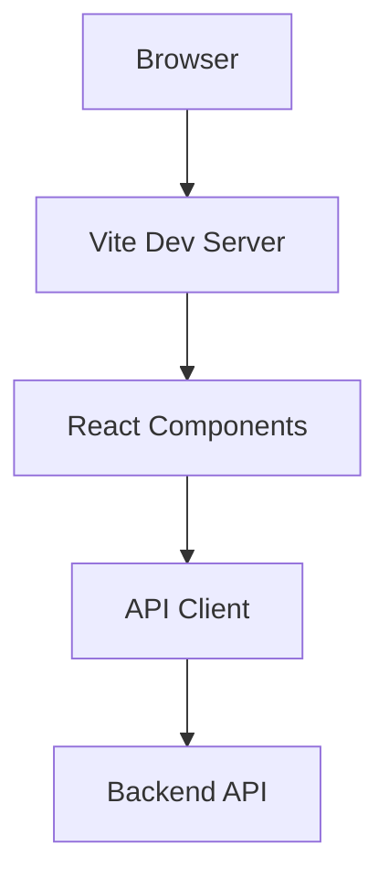

# Architecture Overview

This project follows a modular React architecture using Vite for bundling and TypeScript for type safety.

The application uses React Query for data fetching and Redux Toolkit for global state management. Tailwind CSS handles styling while ESLint and Prettier maintain code quality.
