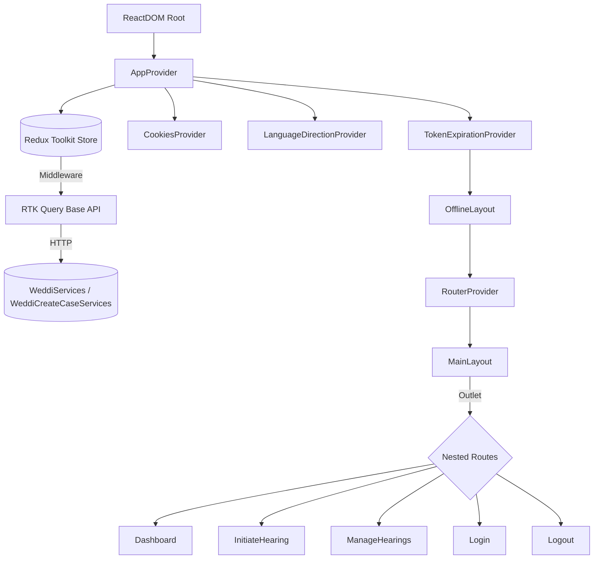
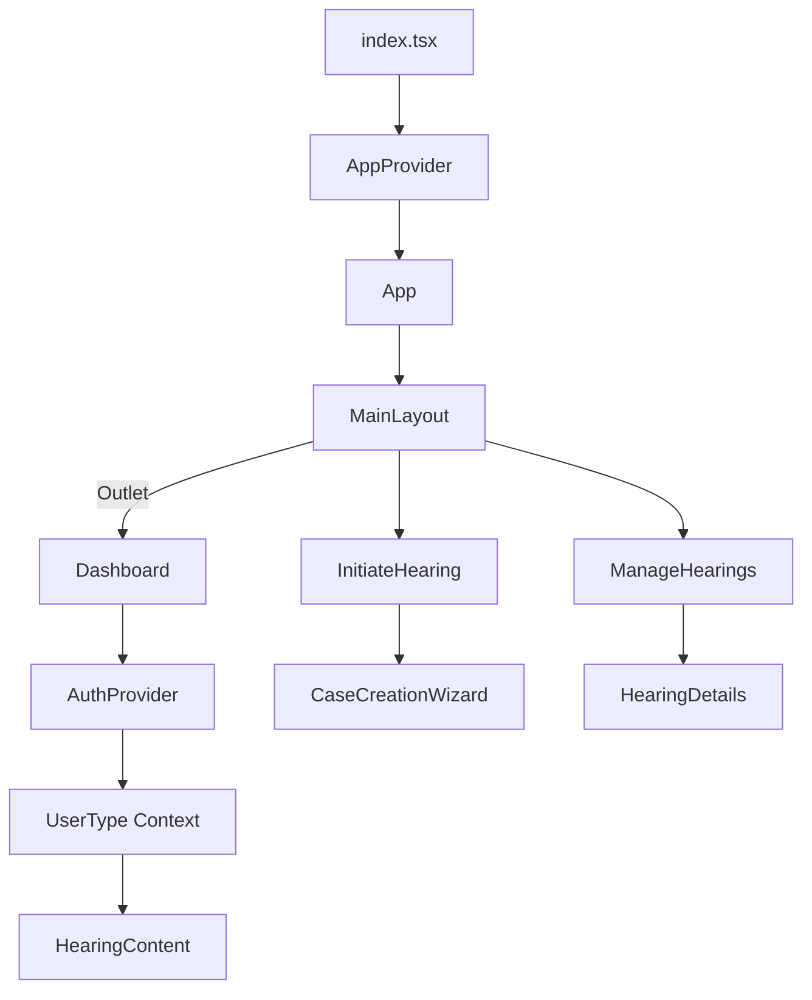

# Weddi Frontend (Clean Edition) — Expanded Technical Documentation

## 1. Executive Summary & Project Overview
**Purpose of this section:** Establish the strategic context for the Weddi Frontend clean edition and outline the business imperatives that guide every architectural and implementation decision.

The Weddi Frontend operates as a highly orchestrated React single-page application (SPA) that is mounted by `index.tsx`, wrapped with a dense provider stack, and ultimately rendered through the React Router tree defined in `App.tsx`. This layered entry point ensures that localization, token lifecycle monitoring, Redux state, and cross-feature utilities are available from the first paint of every route, forming the baseline on which all subsequent features rely.【F:src/index.tsx†L1-L15】【F:src/app/App.tsx†L1-L139】【F:src/providers/AppProvider.tsx†L1-L41】

From a product perspective, the portal is tailored for the Saudi Ministry of Human Resources and Social Development (HRSD) “Amicable Settlement” (Weddi) program. The clean edition reorganizes the interface for the key personas—workers, establishments, legal representatives, and embassy delegates—by fusing persona-aware dashboards, guided hearing initiation flows, and hearing management utilities behind a refactored provider and routing lattice that exposes common services without coupling domain-specific code. The result is a front-end that reduces onboarding friction for new team members while sustaining regulatory and localization requirements through explicit configuration and strongly typed context data.【F:tech-design.md†L9-L38】【F:src/features/dashboard/index.tsx†L1-L75】

Business value is realized through predictable state orchestration (Redux Toolkit + RTK Query), dynamic module loading, and carefully constructed error boundaries. These decisions keep the codebase malleable for feature squads while guaranteeing that hearing submissions, persona switches, and dashboard analytics remain resilient even as backend contracts evolve. The clean edition’s modularity—spanning providers, hooks, and feature directories—stems directly from lessons captured in `tech-design.md`, reinforcing a roadmap where new modules can be introduced or swapped without destabilizing foundational flows.【F:src/app/store/index.ts†L1-L39】【F:src/services/apiClient.ts†L115-L377】【F:tech-design.md†L19-L122】

**Summary / Key Insight:** By grounding the portal in a composable SPA foundation, the clean edition simultaneously advances maintainability and operational reliability. The next section sharpens this narrative by defining the precise scope and audience expectations for the documentation itself, enabling each reader to map the executive vision to their day-to-day responsibilities.

## 2. Purpose & Scope
**Purpose of this section:** Clarify what material this handbook covers, identify its stakeholders, and articulate the scenarios in which it should be consulted.

The documentation spans the entirety of the front-end codebase, prioritizing architectural reasoning, module responsibilities, environment preparation, and operational guardrails. Every part of the `/src` tree, along with build scripts and configuration assets such as `vite.config.ts`, `tailwind.config.js`, and the TypeScript compiler settings, is described in depth. Deliberately excluded are backend API definitions beyond what the front end consumes, infrastructure automation scripts that are not present in the repository, and policy documents owned by HRSD stakeholders; when such elements are referenced, they are contextualized strictly from the perspective of client consumption.【F:vite.config.ts†L1-L63】【F:tailwind.config.js†L1-L190】

| Included Deliverables | Excluded Assets |
| --- | --- |
| Front-end architecture, routing models, provider composition, state orchestration, styling conventions, Vite build behavior, troubleshooting heuristics, and collaboration workflows. | Backend service specifications beyond observed REST interactions, infrastructure-as-code manifests, identity provider internals, analytics configuration, and legal process manuals. |

Primary audiences include front-end engineers implementing new modules, QA analysts devising regression suites, product owners validating release scope, and DevOps staff integrating builds into deployment pipelines. Each persona is guided toward relevant sections—state management deep-dives for engineers, route inventories for QA, and build/deployment instructions for operations—ensuring that every stakeholder can operationalize the shared vocabulary presented here.【F:tech-design.md†L19-L122】

Usage scenarios range from onboarding (understanding provider layering before touching code), to release reviews (verifying that new endpoints respect existing API contracts), to incident retrospectives (tracing token refresh and cookie synchronization flows). The document is structured so that readers can navigate from conceptual overview to implementation specifics without losing sight of the business rationale that underpins each design choice.

**Summary / Key Insight:** With boundaries clearly set, the handbook can now dissect the system architecture in exhaustive detail, allowing each audience to align the abstract mission with the concrete runtime composition described next.

## 3. System Architecture (Comprehensive)
**Purpose of this section:** Provide a rigorous analysis of the architectural layers, runtime interactions, and deployment pipeline that define the Weddi Frontend runtime.

The application operates as a client-rendered SPA, where `App.tsx` constructs a hierarchy of lazy routes nested under a `MainLayout`, and `AppProvider` contributes Redux, error boundaries, cookie context, and language direction awareness before the router is even mounted. By leveraging React’s `Suspense` and route-level `lazy` imports, the architecture optimizes first paint times while ensuring that cross-cutting services (toast notifications, token expiry warnings, offline detection) remain globally available.【F:src/app/App.tsx†L1-L139】【F:src/providers/AppProvider.tsx†L1-L41】

At the infrastructure layer, Redux Toolkit forms the canonical store, integrating loading counters, form data, option caches, and default values alongside the RTK Query API slice defined in `apiClient.ts`. This configuration empowers the SPA to orchestrate asynchronous data flows deterministically; middleware automatically dispatches loading signals, retries on authentication failures, and centralizes API error handling. The resulting state fabric enables complex workflows—like multi-step case creation wizards and persona-based dashboards—to stay synchronized across contexts and browser tabs without manual prop threading.【F:src/app/store/index.ts†L1-L39】【F:src/services/apiClient.ts†L115-L377】

Data access is encapsulated in a custom RTK Query base query that injects legacy and OAuth tokens, appends persona metadata to every request, and invokes toast-driven error normalization routines. This approach decouples feature teams from the specifics of header configuration or error parsing; they simply define endpoints via `api.injectEndpoints`, inheriting the same resilience features regardless of domain. When combined with cookie-aware hooks and providers, the architecture transparently maintains session continuity across reloads and across features that may run concurrently.【F:src/services/apiClient.ts†L115-L240】【F:src/services/apiClient.ts†L240-L382】

On the presentation side, Tailwind CSS provides a utility-first styling foundation augmented by a heavily customized theme that extends breakpoints up to 8K viewports and enumerates granular spacing, typography, and safelist patterns so dynamic grids survive production builds. Components consume this theme through modular directories, enabling designers to rapidly iterate while preserving the portal’s bilingual, RTL-first posture.【F:tailwind.config.js†L1-L190】【F:src/assets/styles/index.css†L1-L140】

The build-to-deploy flow is anchored by Vite. The `build` script performs a TypeScript compilation pass before bundling, with `vite.config.ts` injecting React plugins, static-copy rules for fonts and locales, manual vendor chunking for cache stability, and a `/portal/` base path to accommodate subdirectory hosting. These settings reduce bundle churn, simplify CDN caching strategies, and ensure that static assets are colocated with the hashed JavaScript artifacts produced under `dist/`.【F:package.json†L1-L14】【F:vite.config.ts†L1-L63】



**Summary / Key Insight:** The architecture deliberately entangles providers, store configuration, and build tooling to deliver a robust SPA baseline. Understanding these interdependencies primes readers for the next section, where the filesystem layout illustrates how code organization reinforces the architectural model described here.

## 4. Folder & File Structure (Deep Inspection)
**Purpose of this section:** Decode the repository’s physical structure, demonstrating how directories and key files embody the architectural principles outlined previously.

| Path | Purpose | Notes |
| --- | --- | --- |
| `src/app/App.tsx` | Defines the browser router, lazy module boundaries, error fallbacks, token expiration envelope, and toast container. | Centralizes the `/portal/` basename, ensures each feature is wrapped in `Suspense`, and mounts shared loaders so asynchronous activity remains visible across screens.【F:src/app/App.tsx†L37-L136】 |
| `src/app/store/index.ts` | Bootstraps the Redux store, integrates the RTK Query API reducer, and wires middleware for loading counters. | Ensures DevTools identification, typed exports, and consolidated reducers for loading, form state, form options, and default values, reflecting the domain-driven organization of data dependencies.【F:src/app/store/index.ts†L1-L39】 |
| `src/assets/styles/index.css` & `fonts.scss` | Provide normalized styles, scrollbar overrides, skeleton animations, and IBM Plex Arabic font imports. | Loaded at the application entry point so typography, layout primitives, and cross-browser fixes are applied before components render.【F:src/index.tsx†L3-L13】【F:src/assets/styles/index.css†L1-L140】 |
| `src/config/app.config.ts` & `formConfig.tsx` | Capture user-facing constants (titles, masks) and reusable form-building routines for the hearing wizard. | Supplies `APP_TITLE` for Redux DevTools naming and composes Hijri/Gregorian controls to prevent duplicative validation logic across steps.【F:src/config/app.config.ts†L1-L31】【F:src/config/formConfig.tsx†L1-L125】 |
| `src/features/auth` | Contains login UI, persona selection workflows, token processing, and cookie hydration logic. | `AuthProvider` decodes tokens, orchestrates persona fetches, and updates context, while `LogOut.tsx` wipes session artifacts; components intentionally separate view logic from API mutations.【F:src/features/auth/components/AuthProvider.tsx†L1-L253】【F:src/features/auth/LogOut.tsx†L1-L24】 |
| `src/features/dashboard` | Implements the authenticated landing experience with persona-targeted banners, hearing shortcuts, and schedule data. | Suspense-wrapped entry ensures API-driven widgets resolve gracefully; feature hooks read persona context to tailor content per user role.【F:src/features/dashboard/index.tsx†L1-L75】 |
| `src/features/hearings/initiate` | Hosts the multi-step initiation wizard, including hooks for cookie persistence, modules for each step, and API mutations for case creation. | The `useCookieState` hook synchronizes step data into cookies, while `case-creation` modules emit typed payloads that RTK Query transforms with persona metadata before submission.【F:src/features/hearings/initiate/hooks/useCookieState.ts†L1-L124】【F:src/features/hearings/initiate/modules/case-creation/index.tsx†L1-L55】 |
| `src/features/hearings/manage` | Provides hearing search, pagination, case detail views, and topic update flows post-submission. | Lazy-loaded routes isolate management logic, ensuring initial bundles stay lean while exposing consistent layout and toast behaviors.【F:src/app/App.tsx†L24-L98】 |
| `src/i18n` | Establishes runtime i18next configuration and right-to-left direction handling. | `LanguageDirectionProvider` toggles document direction and exposes typed hooks, while `i18n.tsx` loads language resources on demand to avoid bundling all translations at build time.【F:src/i18n/LanguageDirectionProvider.tsx†L1-L60】 |
| `src/providers` | Aggregates providers for Redux, cookies, date contexts, tabs, form controllers, and user type state. | `AppProvider` composes these providers so route components automatically inherit them; `TokenExpirationProvider` monitors cookie expiry and triggers toast-driven alerts and redirects.【F:src/providers/AppProvider.tsx†L1-L41】【F:src/providers/TokenExpirationProvider.tsx†L1-L75】 |
| `src/services/apiClient.ts` | Central RTK Query configuration managing authentication headers, request transformation, retries, and error handling. | Encapsulates OAuth refresh, legacy token propagation, persona metadata injection, and toast normalization so feature endpoints remain concise and secure.【F:src/services/apiClient.ts†L20-L399】 |
| `src/shared/components` | Home to reusable UI primitives: buttons, loaders, modals, tables, and tab systems. | Components consume Tailwind classes, share context providers (e.g., `TabsProvider`), and surface error fallback UIs for boundary usage throughout the app.【F:src/shared/components/loader/index.tsx†L1-L28】【F:src/shared/components/errors/ErrorFallback.tsx†L1-L38】 |
| `src/shared/hooks` | Encapsulate cookie manipulation, case data clearing, keyboard guards, and navigation helpers. | Hooks such as `useClearCaseData` coordinate with cookies to reset wizard state, demonstrating the interplay between local state and persisted metadata.【F:src/shared/hooks/useClearCaseData.ts†L1-L55】 |
| `src/shared/layouts` | Define shells for authenticated content, offline messaging, and structural elements shared across routes. | `MainLayout` reads persona cookies, exposes context setters, and renders nested outlets alongside modals and structural components.【F:src/shared/layouts/MainLayout.tsx†L1-L145】 |
| `src/utils` | Provide helper functions for API error normalization, date conversion, option mapping, and environment variable access. | `helpers.ts` enforces strict environment variable checks and date normalization, illustrating the repo’s commitment to type-safe utilities that guard runtime invariants.【F:src/utils/helpers.ts†L1-L104】【F:src/utils/api/errorHandler.ts†L1-L120】 |
| `tailwind.config.js` | Tailwind configuration with custom breakpoints, safelist patterns, font families, spacing scales, and plugin placeholders. | Extended to cover 8K displays, ensures grid utilities survive purge, and enforces IBM Plex Arabic as the primary typeface across the portal.【F:tailwind.config.js†L1-L190】 |
| `vite.config.ts` | Configures Vite with React plugins, static asset copying, environment definition, manual chunk splitting, and base path adjustments. | The configuration balances fast development builds with predictable production output, injecting `process.env` values and aliasing `@` to `src` for ergonomic imports.【F:vite.config.ts†L1-L63】 |
| `tsconfig.json` & `tsconfig.paths.json` | Define TypeScript compiler options, strictness levels, and path aliases. | Strict mode with JSX `react-jsx` transform, module resolution, and the `@/*` alias codify TypeScript expectations for all contributors.【F:tsconfig.json†L1-L25】【F:tsconfig.paths.json†L1-L8】 |
| `eslint.config.js` | Flat ESLint configuration for JavaScript/TypeScript/React linting. | Extends recommended rule sets, integrates unused-imports plugin, and configures Node-aware overrides for configuration scripts.【F:eslint.config.js†L1-L44】 |

**Summary / Key Insight:** File-system organization mirrors architectural responsibilities, reinforcing clear ownership boundaries. With the landscape mapped, the subsequent section dives into the technology stack and dependencies that empower these modules.

## 5. Technology Stack & Dependencies
**Purpose of this section:** Enumerate the libraries and tools that underpin the Weddi Frontend, explaining how each contributes to the system’s behavior and maintainability.

The core runtime hinges on React 18 (`react`/`react-dom`) paired with React Router 6 for navigation, Redux Toolkit for predictable state updates, RTK Query for API data fetching, and React Hook Form for form state management. This combination allows components to remain declarative while asynchronous data flows are controlled centrally, ensuring that persona-specific workflows can share patterns without duplicating logic.【F:package.json†L12-L48】

Vite 6.2.6 serves as the build tool, augmented by `@vitejs/plugin-react` and the SWC variant for rapid Hot Module Replacement and efficient production bundles. Tailwind CSS 3.4.x, along with `tailwind-merge` and `tailwindcss-animate`, forms the styling backbone, while PostCSS and Autoprefixer handle browser compatibility. These choices align with the design requirement of delivering a responsive, RTL-aware interface that remains consistent across modern browsers.【F:package.json†L12-L76】【F:tailwind.config.js†L1-L190】

Internationalization is managed via `i18next` and `react-i18next`, with dynamic resource loading courtesy of `i18next-resources-to-backend`. Date management leverages `react-date-object` and `react-multi-date-picker`, complemented by bespoke Hijri conversion utilities. UI accessories such as Headless UI, Heroicons, Radix UI, and Lucide supply accessible primitives and iconography, reducing the need for custom widget engineering while maintaining consistent semantics.【F:package.json†L12-L48】【F:src/utils/helpers.ts†L1-L104】

Supporting dependencies include Axios (legacy or specialized HTTP cases), `jose` for JWT construction in the login workflow, `jwt-decode` for token introspection, `react-toastify` for notifications, and `react-error-boundary` for resilience. Dev-time tooling—ESLint 9, TypeScript 5.7.3, Tailwind CLI, and Vite—ensures that the codebase adheres to modern standards, enabling static analysis, type safety, and reproducible builds across environments.【F:package.json†L12-L76】

**Summary / Key Insight:** The technology stack is purposefully curated to align with the architecture and directory structure, ensuring each dependency plays a distinct role. With the stack understood, we can now specify the environmental requirements that guarantee these tools operate reliably across developer machines and deployment stages.

## 6. Environment & System Requirements
**Purpose of this section:** Define the runtime prerequisites, environment variables, and configuration nuances that must be satisfied before the application can execute correctly.

Node.js 18 LTS or later is recommended to satisfy the requirements of Vite 6.x and the TypeScript 5.7 toolchain, ensuring ES module support and stable performance for both development servers and production builds. npm (bundled with Node) is assumed as the package manager; while alternatives like pnpm or yarn are technically feasible, the repository’s lockfile and scripts are optimized for npm workflows.【F:package.json†L1-L14】

Browser support centers on evergreen browsers capable of interpreting ES2020 modules, CSS variables, and flexbox layouts. Tailwind’s configuration and PostCSS pipeline assume modern rendering engines; QA teams should prioritize Chrome, Edge, and Firefox in current LTS releases, verifying RTL rendering and large-display responsiveness aligned with the extended breakpoints defined in the Tailwind theme.【F:tailwind.config.js†L1-L190】

Environment variables are consumed through both `process.env` (during build/server execution) and `import.meta.env` (within the browser). Critical variables include:
- `VITE_API_URL`: Base URL for WeddiServices and related APIs, used by RTK Query’s `fetchBaseQuery` to route requests.【F:src/services/apiClient.ts†L30-L165】
- `VITE_OAUTH_CLIENT_ID`, `VITE_OAUTH_CLIENT_SECRET`, `VITE_OAUTH_GRANT_TYPE`: OAuth credentials required to mint bearer tokens for API access.【F:src/services/apiClient.ts†L20-L83】
- `VITE_REDIRECT_URL`, `VITE_REDIRECT_URL_LOCAL`, `VITE_LOGIN_SWITCH`: Control session timeout redirects and local-vs-production routing decisions within the `TokenExpirationProvider`.【F:src/providers/TokenExpirationProvider.tsx†L14-L55】
- Additional secrets referenced in helper utilities should be injected via `.env` files or deployment platform configuration, with `getEnvVar` enforcing presence at runtime when necessary.【F:src/utils/helpers.ts†L92-L104】

Local development typically leverages `.env.local`, while CI/CD pipelines should inject variables securely per environment. Because authentication is delegated to an external HRSD identity provider, front-end environments primarily need to manage redirect URLs and API hosts; credential issuance and login flows remain outside this repository’s purview.

**Summary / Key Insight:** Establishing a compliant runtime environment is foundational for the workflows that follow. With prerequisites in place, we can now turn to a step-by-step setup and installation guide that operationalizes these requirements for day-one contributors.

## 7. Setup & Installation Guide
**Purpose of this section:** Deliver a prescriptive onboarding path from cloning the repository through running, verifying, and building the application, while highlighting safeguards that prevent configuration drift.

1. **Clone the repository and install dependencies**
   ```bash
   git clone https://github.com/Salama-Malek/weddi-frontend-clean.git
   cd weddi-frontend-clean
   npm install
   ```
   Installation should complete without peer dependency warnings when using Node ≥18. The `package-lock.json` ensures deterministic dependency resolution.【F:package.json†L1-L14】

2. **Configure environment variables**
   - Create `.env.local` with `VITE_API_URL`, OAuth credentials, and redirect URLs as described in the previous section.
   - Validate the presence of required keys by running a simple script or launching `npm run dev`; missing entries will surface via `getEnvVar` exceptions or failed network calls.【F:src/utils/helpers.ts†L92-L104】

3. **Start the development server**
   ```bash
   npm run dev
   ```
   Vite binds to `http://localhost:5173/portal/` by default (due to the configured `basename`), serving hot-reloaded assets. Console output should confirm module transformation speed and environment variable loading.【F:vite.config.ts†L1-L63】【F:src/app/App.tsx†L117-L139】

4. **Execute quality gates before committing**
   ```bash
   npm run check
   ```
   This script runs `tsc --noEmit` followed by ESLint, catching type regressions and lint infractions early. Contributors should run it before every push to maintain repository health.【F:package.json†L6-L14】

5. **Build a production bundle and preview**
   ```bash
   npm run build
   npm run preview # optional smoke test
   ```
   The build command emits static assets under `dist/`, while `npm run preview` spins up a local server that mirrors production hosting behavior. Inspect the output to ensure hashed asset names and copied fonts/locales exist as expected.【F:package.json†L6-L14】【F:vite.config.ts†L1-L63】

6. **Deployment hand-off**
   - Upload the `dist/` directory to the designated static host or CDN.
   - Confirm that reverse proxies rewrite requests to `/portal/` and that environment variables are injected according to the target stage.

**Developer onboarding checklist**
- [ ] Install Node.js ≥18 and align npm version.
- [ ] Configure `.env.local` with API and OAuth values supplied by environment owners.
- [ ] Run `npm run dev` and confirm that dashboards, initiation flows, and management screens load with persona-specific data.
- [ ] Execute `npm run check` and remediate findings before opening pull requests.
- [ ] Review `AppProvider`, `MainLayout`, and `apiClient` to understand provider layering and request mutation logic prior to making architectural changes.【F:src/providers/AppProvider.tsx†L1-L41】【F:src/shared/layouts/MainLayout.tsx†L1-L145】【F:src/services/apiClient.ts†L115-L377】

**Summary / Key Insight:** A deliberate setup process guarantees that developers encounter a stable baseline. With tooling primed, the next section examines code structure and component hierarchy to guide how contributors extend the interface responsibly.

## 8. Code Structure & Component Hierarchy
**Purpose of this section:** Explain how components compose, how props and context flow through the tree, and why the structure supports modular feature development.

The rendering sequence begins in `index.tsx`, which mounts `AppProvider` and `App` within `React.StrictMode`. `AppProvider` subsequently layers Redux, error boundaries, cookies, tabs, dates, form contexts, and language direction providers before any UI renders. This ensures that every component—regardless of depth—can rely on typed hooks (`useAppDispatch`, `useLanguageDirection`, `useFormContext`) instead of bespoke prop drilling or duplicated state containers.【F:src/index.tsx†L1-L15】【F:src/providers/AppProvider.tsx†L1-L41】

`App.tsx` defines routes that defer feature module loading using React’s `lazy` and `Suspense`. Each route is wrapped in `LazyLoader` with a shared `Loader` overlay, while the case creation stepper uses `StepperSkeleton` for localized skeleton states. The `RouterProvider` is itself wrapped inside an `OfflineLayout`, allowing global offline banners and network-aware UX to remain consistent across all pages.【F:src/app/App.tsx†L19-L139】

`MainLayout` acts as the bridge between providers and routed components: it hydrates persona state from cookies, exposes user type context setters, and renders structural components like headers and modals around an `Outlet`. Downstream components (dashboard banners, hearing modules) read persona flags and tokens via context hooks, ensuring consistent behavior even when the user switches roles mid-session.【F:src/shared/layouts/MainLayout.tsx†L1-L145】【F:src/providers/context/userTypeContext.tsx†L37-L82】

Props typically flow top-down for presentational elements, while domain state flows through contexts and Redux slices. For example, the dashboard page reads persona context to determine which cards to show, while `AuthProvider` writes context updates when NIC details or persona lookups resolve. The hearing initiation wizard leverages React Hook Form, cookie hooks, and Redux slices to share data between steps, ensuring data persistence even if the user reloads mid-process.【F:src/features/dashboard/index.tsx†L1-L75】【F:src/features/auth/components/AuthProvider.tsx†L121-L253】【F:src/features/hearings/initiate/hooks/useCookieState.ts†L1-L124】



Naming conventions follow PascalCase for components (`MainLayout.tsx`), camelCase for hooks (`useClearCaseData.ts`), and feature-based directory segmentation (`src/features/<domain>`). Shared utilities reside under `src/shared` or `src/utils`, enabling cross-domain reuse without leaking implementation details. This structure encourages modularity: teams can introduce new feature directories with minimal cross-cutting impact, provided they register routes and context needs appropriately.

**Summary / Key Insight:** Understanding the component hierarchy reveals how context and routing cooperate to deliver cohesive workflows. This clarity sets the stage for the next section, which analyzes styling and theming choices that maintain visual coherence across the portal.

## 9. Styling and Theming
**Purpose of this section:** Describe the styling framework, theming strategies, and design tokens that shape the Weddi Frontend’s visual identity and accessibility.

Tailwind CSS underpins the styling strategy, enriched with custom breakpoints that extend up to 8K displays and container widths locked to 100% across large screens. This configuration supports the wide range of devices used by HRSD stakeholders, from standard desktops to large-format displays in service centers. The safelist patterns guarantee that dynamic grid utilities survive production purging, preventing layout regressions in modules where column counts are computed at runtime.【F:tailwind.config.js†L8-L63】

Typography is standardized through the IBM Plex Arabic font family, imported globally via `fonts.scss` and applied using Tailwind’s extended `fontFamily` definitions. Additional theme extensions enumerate fine-grained spacing, padding, and border-radius values, enabling designers to express nuanced layouts without resorting to inline styles. Color tokens and animation utilities are defined in Tailwind and supplemented by `index.css`, which also normalizes scrollbars, tables, and skeleton loaders to maintain an accessible visual rhythm.【F:tailwind.config.js†L24-L190】【F:src/assets/styles/index.css†L1-L140】

The theming approach emphasizes RTL readiness and bilingual support. `LanguageDirectionProvider` toggles the document direction attribute whenever the user changes languages, ensuring that all flex and grid layouts respond appropriately. Loader components and progress indicators rely on brand accent colors that align with HRSD’s palette, creating a consistent experience across dashboards, wizards, and management screens.【F:src/i18n/LanguageDirectionProvider.tsx†L20-L49】【F:src/shared/components/loader/index.tsx†L1-L28】

**Summary / Key Insight:** Styling choices—rooted in Tailwind’s extensibility and language-aware providers—guarantee visual continuity and accessibility. With the look and feel established, the documentation turns to routing and navigation to map how users traverse these themed experiences.

## 10. Routing and Navigation
**Purpose of this section:** Catalog the routing topology, explain navigation safeguards, and illustrate how route composition aligns with feature boundaries.

`App.tsx` defines a `createBrowserRouter` configuration with a `/portal/` basename to support deployments where the SPA is served from a subdirectory. Under the root path, `MainLayout` hosts an index route for the dashboard, an initiate-hearing route with nested case-creation stepper, and manage-hearings routes for listing, details, and topic updates. Lazy imports ensure that initiating or managing hearings loads only when required, reducing the initial bundle footprint.【F:src/app/App.tsx†L41-L99】【F:src/app/App.tsx†L117-L139】

Standalone `/portal/login` and `/portal/logout` routes accommodate explicit login/logout flows. `Logout` clears cookies and local storage before redirecting to environment-configured URLs, while `LoginLazy` presents the persona selection interface and token bootstrap logic. Error fallbacks wrap each route tree to ensure that unexpected failures surface via controlled UI rather than blank screens.【F:src/app/App.tsx†L101-L114】【F:src/features/auth/LogOut.tsx†L1-L24】

Navigation guards derive from providers rather than route wrappers: `TokenExpirationProvider` monitors session validity, `OfflineLayout` exposes connectivity banners, and `MainLayout` surfaces NIC error modals or persona-change hooks when backend responses demand intervention. This design preserves a declarative routing configuration while still enforcing business rules that cut across multiple routes.【F:src/providers/TokenExpirationProvider.tsx†L14-L75】【F:src/shared/layouts/MainLayout.tsx†L1-L145】

**Summary / Key Insight:** The router mirrors feature boundaries and layers safeguards through providers instead of imperative route guards. With navigation defined, we can now delve into how data management and API integration sustain these routes with real-time information.

## 11. Data Management and API Integration
**Purpose of this section:** Detail the mechanisms for fetching, transforming, and handling data from backend services, ensuring consistency and resilience across features.

RTK Query’s `createApi` is configured in `apiClient.ts` with a custom base query that attaches both legacy (`accesstoken`) and OAuth (`Authorization`) headers to outgoing requests. Before each call, `transformRequest` injects persona-aware metadata—such as SourceSystem, IDNumber, PlaintiffId, FileNumber, and government selections—so backend services receive complete context without requiring each endpoint to reimplement the logic. This systematic transformation enforces parity between user state and API payloads, reducing risk during persona switches or wizard restarts.【F:src/services/apiClient.ts†L115-L316】

When APIs respond with `invalid_token` errors or HTTP 401/403 statuses, the base query triggers `refreshToken`, which exchanges client credentials against `/WeddiOauth2/v1/token`, caches the OAuth token in cookies with explicit expiry, and retries the original request. Error responses are normalized via `handleApiResponseLegacy` and `handleApiError`, which convert backend codes into toast notifications or throw typed errors captured by global boundaries. This approach balances user feedback with developer diagnostics, ensuring that failure modes remain observable but non-disruptive.【F:src/services/apiClient.ts†L20-L194】【F:src/services/apiClient.ts†L321-L399】

Feature modules register endpoints via `api.injectEndpoints`, leveraging the base query to fetch persona data (`GetUserType`), NIC details, dashboard statistics, hearing lists, and wizard-related lookups or mutations. Hooks generated by RTK Query return typed data, loading states, and error flags, allowing components to coordinate UI transitions without manual promise handling. Hooks like `useCookieState` further augment data flows by persisting wizard progress to cookies, ensuring continuity across reloads or multi-tab sessions.【F:src/features/auth/components/AuthProvider.tsx†L121-L253】【F:src/features/hearings/initiate/hooks/useCookieState.ts†L1-L124】

**Summary / Key Insight:** Data management is centralized through RTK Query and cookie-aware utilities, supplying reliable inputs to every feature. This cohesive layer dovetails with TypeScript’s strictness, which the next section examines to show how type safety is enforced across the project.

## 12. TypeScript Usage and Type Safety
**Purpose of this section:** Illuminate how TypeScript configuration, interfaces, and runtime guards contribute to maintainability and correctness.

`tsconfig.json` enables strict mode, ESNext module resolution, JSX `react-jsx` transform, and JSON module support, while `tsconfig.paths.json` aliases `@/*` to `src`. This configuration standardizes imports and encourages type-safe module resolution throughout the codebase. Combined with `tsc --noEmit` during checks, it enforces compile-time guarantees before code reaches runtime.【F:tsconfig.json†L1-L25】【F:tsconfig.paths.json†L1-L8】

Context hooks throw descriptive errors when consumed outside their providers (e.g., `LanguageDirectionProvider`, `TokenExpirationProvider`, `UserTypeContext`), providing defensive runtime checks that complement TypeScript’s compile-time assurances. Redux slices leverage typed state shapes, and RTK Query endpoints return specific interfaces for API responses, reducing the need for casting and guarding against contract drift when backend payloads change.【F:src/i18n/LanguageDirectionProvider.tsx†L20-L60】【F:src/providers/TokenExpirationProvider.tsx†L14-L75】【F:src/app/store/index.ts†L1-L39】

Utility functions such as `getEnvVar` enforce type-safe environment variable retrieval, converting strings to numbers or booleans as needed and throwing early if required keys are missing. Date normalization helpers perform strict validation with exhaustive regex and calendar conversions, ensuring that Hijri data propagated through forms remains consistent with backend expectations.【F:src/utils/helpers.ts†L92-L155】

**Summary / Key Insight:** TypeScript’s strict configuration and runtime guards form a safety net that underpins every API call and context interaction. With correctness ensured at the compiler and runtime layers, we next explore linting, formatting, and quality gates that keep the codebase disciplined.

## 13. Linting, Formatting & Quality Gates
**Purpose of this section:** Document the static analysis tooling and workflows that enforce coding standards and prevent regressions.

The flat `eslint.config.js` extends core JavaScript, TypeScript, and React rule sets, integrates `eslint-plugin-unused-imports` to remove stale code, and configures parser options compatible with the ES module setup. Overrides treat configuration files as CommonJS, ensuring Node-specific globals are recognized without polluting application code. By running ESLint alongside `tsc --noEmit` in the `npm run check` script, the project guarantees that both syntax and type-level issues surface during the same command, streamlining developer workflows.【F:eslint.config.js†L1-L44】【F:package.json†L6-L14】

Formatting is implicitly handled by editors configured with Prettier defaults; while no explicit `.prettierrc` is present, the repository encourages consistent formatting via IDE integration and lint rules that enforce import ordering and whitespace hygiene. Contributors are encouraged to adopt shared workspace settings or add Prettier configuration if team standards require more explicit enforcement.【F:eslint.config.js†L1-L44】

Although no pre-commit hooks or CI workflows are currently checked into the repository, integrating `npm run check` into CI pipelines is highly recommended. Doing so ensures that every pull request is validated for type safety and lint compliance before merge, preserving the quality baseline that the clean edition aims to uphold.【F:package.json†L6-L14】

**Summary / Key Insight:** Static analysis and linting underpin the project’s reliability, complementing TypeScript’s safeguards. The absence of automated tests, however, is a known gap, prompting the next section to evaluate testing strategy and coverage aspirations.

## 14. Testing Framework & Coverage
**Purpose of this section:** Assess the current state of automated testing, identify gaps, and suggest high-impact areas for future investment.

At present, the repository lacks unit or integration test suites; there is no `test` script in `package.json`, and no testing libraries are installed beyond what dependencies implicitly provide. Consequently, QA cycles rely on manual regression passes focusing on authentication flows, case initiation, and dashboard data integrity. This approach, while functional, risks regressions slipping through during rapid iteration.【F:package.json†L6-L14】

Future efforts should prioritize introducing Vitest (compatible with Vite projects) alongside React Testing Library to cover critical components such as `AuthProvider`, `MainLayout`, and the hearing wizard modules. Testing strategy should emphasize token refresh logic, cookie synchronization, and persona switching, as these mechanisms underpin multiple routes and are prone to subtle edge cases. Establishing smoke tests for route availability and loader transitions would further bolster confidence during deployments.

**Summary / Key Insight:** Recognizing the testing gap provides impetus for process improvements. The build and deployment pipeline must compensate by maintaining rigorous checks, as detailed in the next section.

## 15. Build and Deployment Pipeline
**Purpose of this section:** Explain how builds are produced, what artifacts they generate, and how deployment workflows should be orchestrated for consistency across environments.

The build pipeline is straightforward yet deliberate: `npm run build` first runs TypeScript compilation (`tsc`) before invoking `vite build`, ensuring that type errors block the creation of production assets. Vite’s configuration sets the base path to `/portal/`, applies React plugins, copies static assets (fonts, locales), and defines manual vendor chunking to stabilize cache keys across releases. The resulting `dist/` directory contains hashed JavaScript and CSS files alongside copied static resources ready for CDN distribution.【F:package.json†L6-L14】【F:vite.config.ts†L1-L63】

Deployment should follow a predictable sequence: install dependencies (leveraging lockfile-based caching), run `npm run check` to enforce quality gates, execute the build, archive the `dist/` output, and publish it to the hosting environment. Reverse proxies or static hosts must rewrite requests to `/portal/` to ensure deep links resolve correctly; failure to do so will manifest as 404 errors when reloading nested routes. Integrating smoke tests via `npm run preview` post-build can catch environment-specific misconfigurations before shipping to production.【F:vite.config.ts†L1-L63】

**Summary / Key Insight:** A deterministic build pipeline undergirds reliable deployments. Nevertheless, operational environments inevitably encounter failures, so the next section provides a comprehensive troubleshooting reference.

## 16. Troubleshooting / FAQ
**Purpose of this section:** Compile common failure modes, diagnose root causes, and prescribe actionable resolutions to support rapid incident response.

| Issue | Cause | Resolution |
| --- | --- | --- |
| Redirect loop between portal and identity provider | Token cookie missing or expired; `TokenExpirationProvider` cleared session and redirected. | Inspect browser cookies for `token`; reauthenticate via the external HRSD identity provider and verify `VITE_REDIRECT_URL(_LOCAL)` correctness to avoid redirect mismatches.【F:src/providers/TokenExpirationProvider.tsx†L14-L55】 |
| Dashboard modules stuck in loading state | `AuthProvider` awaiting NIC data or persona lookups due to missing `MyClientsToken`. | Ensure the initial redirect includes the token parameter, clear stale cookies via `/logout`, and confirm backend availability for `GetNICDetails`.【F:src/features/auth/components/AuthProvider.tsx†L121-L205】 |
| Legal representative persona modal cannot proceed | Main/Sub government selections not persisted, causing validation guard to block submission. | Select both dropdown values in `LoginAccountSelect`; confirm that cookie synchronization is functional so selections propagate to `transformRequest`.【F:src/features/auth/components/LoginAccountSelect.tsx†L108-L197】【F:src/services/apiClient.ts†L240-L309】 |
| OAuth requests return 401 | Refresh token flow missing environment credentials or encountering expired secrets. | Populate `VITE_OAUTH_CLIENT_ID/SECRET/GRANT_TYPE` and verify they align with backend configuration; monitor `refreshToken` logs for error states.【F:src/services/apiClient.ts†L20-L87】 |
| Case wizard loses progress after reload | `useCookieState` prevented updates due to `caseDataCleared` flag. | Invoke `useClearCaseData` reset helper or remove the `caseDataCleared` cookie to restore persistence before continuing the wizard.【F:src/features/hearings/initiate/hooks/useCookieState.ts†L52-L75】【F:src/shared/hooks/useClearCaseData.ts†L43-L55】 |
| Persona switches leave stale data on dashboard | Persona-specific cookies persisted across sessions. | Trigger `/logout` to clear cookies, or manually remove persona cookies through browser tools before logging in as a different role.【F:src/features/auth/LogOut.tsx†L1-L24】 |
| Tailwind classes missing in production build | Purge step removed dynamically generated class names not present in source. | Extend the safelist patterns in `tailwind.config.js` or refactor dynamic class generation to match existing regexes, ensuring required utilities survive tree-shaking.【F:tailwind.config.js†L8-L63】 |
| Layout renders left-to-right for Arabic locale | `LanguageDirectionProvider` failed to initialize or translation namespace missing. | Confirm `AppProvider` includes the provider and that `i18n` resources load the `meta` namespace containing language metadata. Reload the page after clearing caches if necessary.【F:src/providers/AppProvider.tsx†L17-L40】【F:src/i18n/LanguageDirectionProvider.tsx†L20-L49】 |
| Toasts show raw backend error codes | Error handler lacks custom message mapping for returned code. | Extend `customErrorMessages` within error handlers or adjust `SUPPRESSED_ERROR_CODES` to translate responses before surfacing to users.【F:src/utils/api/errorHandler.ts†L1-L120】 |
| Loader overlay never dismisses after API failure | Loading slice `pendingCount` not decremented because exception thrown before `stopLoading`. | Review API call sites to ensure errors propagate after Redux `stopLoading`; consider wrapping asynchronous flows in `try/finally` to guarantee decrement semantics.【F:src/app/store/slices/loadingSlice.ts†L1-L21】【F:src/services/apiClient.ts†L115-L194】 |
| Local preview serves blank page | Host missing `/portal/` rewrite or `npm run preview` executed without build artifacts. | Execute `npm run build` before `npm run preview` and configure static host rewrites to funnel all portal paths to the SPA entry point.【F:vite.config.ts†L1-L63】 |

**Summary / Key Insight:** Troubleshooting guidance equips teams to respond swiftly to operational anomalies. Security and performance considerations intertwine with these issues, prompting the next section to analyze safeguards and optimizations baked into the codebase.

## 17. Security and Performance Notes
**Purpose of this section:** Highlight measures that protect user data, maintain session integrity, and optimize performance under real-world load.

Security starts with token management. `TokenExpirationProvider` decodes JWT payloads, warns users five minutes before expiry, and removes tokens upon expiration, triggering redirects based on configured URLs. Coupled with OAuth refresh logic in `apiClient.ts`, the portal maintains authenticated sessions without exposing tokens unnecessarily. Cookies are saved with path scoping and, via `useCookieService`, can enforce the `secure` flag outside development, reducing attack surface for sensitive identifiers.【F:src/providers/TokenExpirationProvider.tsx†L14-L55】【F:src/services/apiClient.ts†L20-L194】【F:src/shared/hooks/useCookies.ts†L1-L38】

Performance gains stem from lazy route loading, manual vendor chunking, and aggressive caching strategies. Vite’s manual chunk configuration stabilizes vendor bundle names, enabling long-term caching. Loader overlays are driven by a Redux `pendingCount`, ensuring that simultaneous API calls do not flicker the UI. Cookie-synchronized hooks (`useCookieState`, `useClearCaseData`) prevent redundant network requests by persisting relevant metadata across sessions and tabs.【F:vite.config.ts†L26-L63】【F:src/app/store/slices/loadingSlice.ts†L1-L21】【F:src/features/hearings/initiate/hooks/useCookieState.ts†L1-L124】

Accessibility and resilience also contribute to perceived performance. `OfflineLayout` surfaces connectivity changes early, while i18n providers ensure text direction and translations load without blocking UI rendering. These design decisions keep the interface responsive and informative even when network conditions degrade or when the user toggles languages mid-session.【F:src/app/App.tsx†L10-L139】【F:src/i18n/LanguageDirectionProvider.tsx†L20-L49】

**Summary / Key Insight:** Security and performance strategies are interwoven through providers, hooks, and build tooling. Maintaining these characteristics requires disciplined collaboration, which the contribution guidelines detail next.

## 18. Contribution Guidelines
**Purpose of this section:** Establish conventions for branching, commits, code style, and review expectations to maintain the clean edition’s standards.

Branches should follow a `feature/<scope>` or `bugfix/<scope>` pattern, rebasing against `main` regularly to minimize merge conflicts. Every pull request should reference the relevant tracker (e.g., Jira ticket) and include screenshots or GIFs for UI changes, ensuring reviewers can evaluate visual regressions efficiently. Running `npm run check` before pushing is mandatory to uphold type and lint quality gates.【F:package.json†L6-L14】

Commit messages benefit from the Conventional Commits format (`feat(dashboard): ...`, `fix(api): ...`), which simplifies changelog generation and communicates intent clearly. Code style expectations favor functional components, hooks, and Tailwind utility classes; class components and inline styles should be avoided unless dealing with highly dynamic theming scenarios like loader accents. New stateful logic should integrate with Redux slices or context providers rather than ad hoc global variables, preserving testability and clarity.【F:src/shared/components/loader/index.tsx†L1-L28】【F:src/app/store/index.ts†L1-L39】

Reviews should verify that new API calls leverage `api.injectEndpoints`, that translations are updated when user-facing copy changes, and that persona cookies remain consistent. Feature authors are encouraged to document complex flows within `tech-design.md` or supplementary docs, keeping institutional knowledge centralized.【F:tech-design.md†L19-L122】

**Summary / Key Insight:** Consistent contribution practices safeguard the project’s cleanliness. Tracking releases through changelogs provides transparency, motivating the next section’s focus on versioning strategy.

## 19. Change Log & Version History
**Purpose of this section:** Advocate for disciplined versioning and provide a template for documenting changes over time.

The repository currently declares version `0.0.0`, signifying a pre-release state. Adopting Semantic Versioning (`MAJOR.MINOR.PATCH`) empowers teams to communicate breaking changes, feature additions, and bug fixes succinctly. Each release should capture highlights under Added/Changed/Fixed headings, enabling stakeholders to assess upgrade impact rapidly.【F:package.json†L1-L5】

Example entry:
```
## [1.1.0] - 2025-03-31
### Added
- Legal representative dashboard banner enhancements drawing on new schedule endpoints.
### Changed
- Upgraded Vite to 6.2.6 to leverage improved legacy plugin support.
### Fixed
- Resolved OAuth token refresh race condition impacting idle sessions.
```
Maintaining such records in `CHANGELOG.md` (or similar) streamlines communication across engineering, QA, and operations.

**Summary / Key Insight:** Transparent version history underpins coordinated releases. Looking forward, the roadmap of future improvements clarifies where the clean edition can evolve next.

## 20. Future Improvements and Next Steps
**Purpose of this section:** Outline strategic enhancements that would elevate reliability, developer experience, and feature velocity.

High-priority initiatives include introducing automated tests (Vitest + React Testing Library) for authentication, routing guards, and wizard flows; establishing Storybook or a similar component workbench to document shared UI primitives; and expanding performance monitoring via Lighthouse CI or Web Vitals dashboards. These actions would catch regressions earlier and document component behavior for design alignment.【F:src/features/auth/components/AuthProvider.tsx†L121-L253】【F:src/shared/components/loader/index.tsx†L1-L28】

Type safety can be further hardened by refining Redux slices that currently rely on loosely typed defaults (`any` usage in form reducers). Additionally, automating locale synchronization, introducing environment variable templates, and exploring performance budgeting (e.g., limiting bundle size growth per release) would keep the clean edition scalable as new features land.【F:src/app/store/slices/formSlice.ts†L1-L24】【F:src/utils/helpers.ts†L92-L155】

**Summary / Key Insight:** A proactive improvement roadmap ensures the clean edition remains sustainable. Before implementing these ideas, stakeholders should revisit foundational terminology and references, presented in the appendices below.

## 21. Appendices
**Purpose of this section:** Provide reference material—glossary, related documentation, and external links—to support contextual understanding.

- **Glossary**
  - *Weddi*: HRSD’s Amicable Settlement program for employment dispute resolution, serviced through this portal.【F:tech-design.md†L1-L27】
  - *NIC*: National Identity Center service that validates user identity during login workflows.【F:src/features/auth/components/AuthProvider.tsx†L133-L205】
  - *Persona*: Role-specific identity (Worker, Establishment, Legal representative, Embassy delegate) dictating UI access and payload metadata.【F:src/features/auth/components/LoginAccountSelect.tsx†L108-L197】

- **Related documents**
  - `tech-design.md`: Architecture, module responsibilities, and data flow diagrams for the portal.【F:tech-design.md†L9-L148】
  - `code-doc.md`: Component-level summaries complementing this handbook’s architectural focus.【F:code-doc.md†L1-L70】

- **External references**
  - HRSD identity provider documentation (external): governs authentication flows consumed by this front-end.
  - WeddiServices REST API specifications (internal): describe request/response payloads referenced by RTK Query endpoints.

**Summary / Key Insight:** Armed with terminology and references, contributors can bridge code to institutional knowledge. The subsequent onboarding notes translate these insights into actionable guidance for new developers.

## Final Notes and Recommendations for New Developers
**Purpose of this section:** Offer onboarding guidance tailored to engineers who are newly responsible for extending or maintaining the Weddi Frontend.

1. **Start with provider composition:** Read `AppProvider`, `MainLayout`, and `apiClient` before touching feature code. Understanding how providers wrap the router, how persona state is injected, and how API requests are transformed will prevent missteps when adding new routes or endpoints.【F:src/providers/AppProvider.tsx†L1-L41】【F:src/shared/layouts/MainLayout.tsx†L1-L145】【F:src/services/apiClient.ts†L115-L377】
2. **Trace persona data end-to-end:** Follow the flow from `AuthProvider` through cookie persistence (`useCookieState`, `useClearCaseData`) and into RTK Query transforms. This reveals why certain cookies exist and how they influence headers or payloads, which is critical when debugging role-based behavior.【F:src/features/auth/components/AuthProvider.tsx†L121-L253】【F:src/features/hearings/initiate/hooks/useCookieState.ts†L1-L124】
3. **Review shared components and hooks:** Explore `src/shared/components` and `src/shared/hooks` to avoid reinventing primitives or utilities. Tabs, loaders, and cookie services are already battle-tested; reuse them to maintain consistency.【F:src/shared/components/loader/index.tsx†L1-L28】【F:src/shared/hooks/useClearCaseData.ts†L1-L55】
4. **Be mindful of environment dependencies:** Before working on features that touch authentication or data fetching, ensure your `.env.local` mirrors staging configurations. Missing OAuth credentials or API URLs manifest as runtime failures that can be mistaken for code regressions.【F:src/services/apiClient.ts†L20-L170】【F:src/utils/helpers.ts†L92-L104】
5. **Anticipate RTL and localization impact:** When adding layouts or copy, test both Arabic and English views. Confirm that direction changes via `LanguageDirectionProvider` do not break flex/grid structures and that translations exist for new strings.【F:src/i18n/LanguageDirectionProvider.tsx†L20-L49】
6. **Coordinate with QA early:** Because automated tests are not yet implemented, collaborate with QA analysts to script manual regression steps for features you touch. Provide them with route paths and persona scenarios to streamline verification.
7. **Document architectural decisions:** Significant changes—new providers, state slices, or routing paradigms—should be captured in `tech-design.md` or supplementary docs. This keeps institutional knowledge alive and prevents regression into ad hoc patterns.【F:tech-design.md†L19-L122】

Following this path helps new developers acclimate quickly while preserving the clean edition’s architectural rigor.

---
**Next Steps for Documentation Automation:** Investigate generating API reference tables directly from RTK Query endpoint metadata and scheduling CI jobs that diff translation files and environment schemas, ensuring documentation stays synchronized with code changes at every merge.
