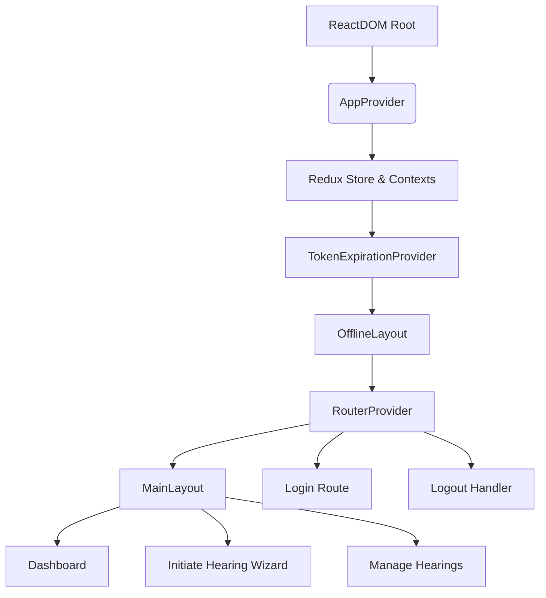
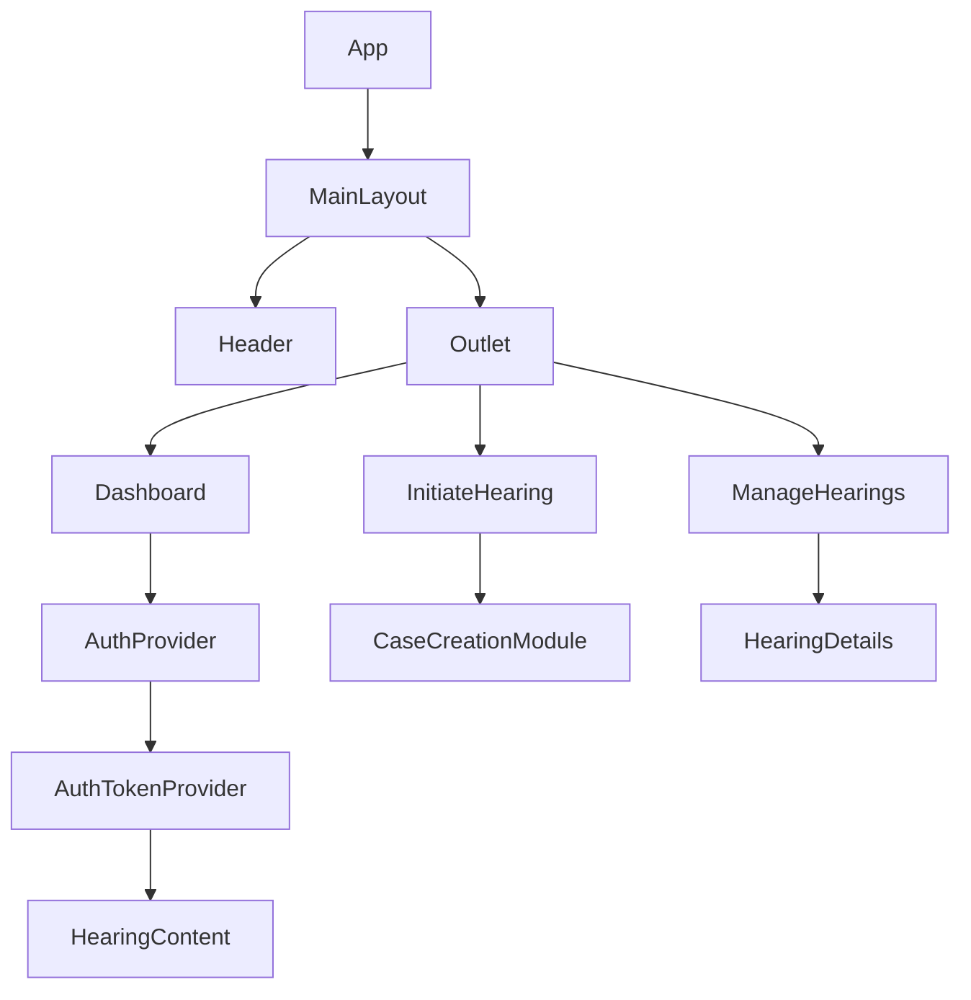

# Weddi Frontend (Clean Edition) — Technical Documentation

## 1. Executive Summary & Project Overview
- **Purpose & context:** Weddi Frontend delivers the Saudi HRSD “Amicable Settlement” (Weddi) single-page application with route-level suspense, offline resilience, and role-aware layouts orchestrated from a centralized React 18 shell.【F:src/app/App.tsx†L1-L139】
- **Target personas:** Workers, establishments, legal representatives, and embassy delegates authenticate through token handoff, hydrate cookies, and receive personalized dashboard, initiation, and management flows.【F:src/features/dashboard/index.tsx†L1-L75】【F:src/features/auth/components/AuthProvider.tsx†L1-L253】
- **Business value:** The clean edition packages a maintainable architecture—feature-driven directories, context providers, and RTK Query services—to accelerate settlement operations while preserving regulatory controls (token refresh, NIC validation, localized UX).【F:tech-design.md†L9-L96】【F:src/services/apiClient.ts†L1-L194】
- **Key differentiators:** Refactored store slices, shared providers, and dynamic imports reduce coupling, improve reliability, and allow modular upgrades of dashboards, hearing wizards, and case management widgets without cross-cutting regressions.【F:src/app/store/index.ts†L1-L39】【F:src/providers/AppProvider.tsx†L1-L41】【F:src/features/hearings/initiate/modules/case-creation/index.tsx†L1-L55】

## 2. Purpose & Scope
| Included | Excluded |
| --- | --- |
| Architecture, routing, state, providers, styling, build tooling, environment parity, deployment, troubleshooting, and contribution practices. | Backend API specifications beyond observed request contracts; infrastructure-as-code; analytics configuration; HRSD policy manuals. |

- **Audience:** Front-end engineers, QA analysts, product owners, DevOps engineers, and stakeholders onboarding to or operating the Weddi UI layer.
- **Usage scenarios:** Rapid onboarding, regression planning, release reviews, compliance audits, and handovers between squads.

## 3. System Architecture (Comprehensive)
- **Concept:** React SPA served by Vite, orchestrating feature routes under a `MainLayout` that injects providers for Redux, cookies, forms, language direction, and session expiry handling.【F:src/index.tsx†L1-L15】【F:src/providers/AppProvider.tsx†L1-L41】【F:src/shared/layouts/MainLayout.tsx†L1-L145】
- **Logical layers:**
  - *Presentation:* Tailwind-enhanced components (buttons, loaders, modals) render persona-specific flows with Suspense fallbacks.【F:src/shared/components/loader/index.tsx†L1-L28】【F:tailwind.config.js†L9-L114】
  - *Routing:* Browser router with nested routes for dashboard, initiate, manage, login, and logout; base path `/portal/` for shared hosting.【F:src/app/App.tsx†L41-L119】
  - *State management:* Redux Toolkit store binds RTK Query API with UI slices; contexts (UserProvider, TokenExpirationProvider) complement cookie-backed persistence.【F:src/app/store/index.ts†L1-L39】【F:src/providers/TokenExpirationProvider.tsx†L1-L74】【F:src/providers/context/userTypeContext.tsx†L1-L82】
  - *Data services:* Custom RTK Query base query injects authorization headers, refreshes OAuth, and appends persona metadata before dispatching to Weddi services.【F:src/services/apiClient.ts†L20-L204】
  - *Utilities:* Cookie state hook, date validation builders, and API error suppressors unify domain logic across features.【F:src/features/hearings/initiate/hooks/useCookieState.ts†L1-L124】【F:src/utils/api/errorHandler.ts†L1-L120】
- **Build to deployment flow:** `npm run build` triggers TypeScript compilation then Vite bundle generation into `dist/`, using manual vendor chunking and static asset copying (locales, fonts) for CDN-ready hosting.【F:package.json†L6-L10】【F:vite.config.ts†L1-L43】



## 4. Folder & File Structure (Deep Inspection)
| Path | Purpose | Notes |
| --- | --- | --- |
| `src/app/App.tsx` | Route composition with Suspense loaders, offline layout, and toast container. | Base path `/portal/`, lazy modules for dashboard/hearing, token expiration wrapper.【F:src/app/App.tsx†L37-L136】 |
| `src/app/store` | Redux store and slices for loading indicators, form data, options, and defaults. | Store concatenates RTK Query middleware and exposes typed dispatch/state helpers.【F:src/app/store/index.ts†L1-L39】【F:src/app/store/slices/loadingSlice.ts†L1-L21】 |
| `src/assets` | Fonts, icons, images, and global CSS/SCSS tokens. | `styles/index.css` normalizes typography, scrollbars; `styles/fonts.scss` loads IBM Plex fonts.【F:src/assets/styles/index.css†L1-L140】 |
| `src/config` | App constants and dynamic form builders. | `app.config.ts` phone masks; `formConfig.tsx` builds reusable date/field components for steps.【F:src/config/app.config.ts†L1-L31】【F:src/config/formConfig.tsx†L1-L125】 |
| `src/features/auth` | Login form, logout redirect, OAuth/NIC bootstrap, persona selection modal. | `AuthProvider` decodes tokens, fetches persona data, primes cookies; `LoginAccountSelect` drives user-type selection UI.【F:src/features/auth/components/AuthProvider.tsx†L1-L253】【F:src/features/auth/components/LoginAccountSelect.tsx†L1-L213】 |
| `src/features/dashboard` | Authenticated landing (banner, cards, schedules, help center) backed by APIs. | Main entry clears case data, renders role-specific banners under Suspense.【F:src/features/dashboard/index.tsx†L1-L75】 |
| `src/features/hearings/initiate` | Multi-step case creation wizard with attachments, lookups, OTP, review. | Houses API modules, hooks (`useCookieState`), and modules per step (case creation).【F:src/features/hearings/initiate/hooks/useCookieState.ts†L1-L124】【F:src/features/hearings/initiate/modules/case-creation/index.tsx†L1-L55】 |
| `src/features/hearings/manage` | Case list, details, topic updates for post-submission hearings. | Components such as `ManageHearings` and `HearingDetails` consume shared layout and API hooks.【F:src/app/App.tsx†L26-L96】 |
| `src/i18n` | i18next bootstrap, lazy resource loading, and direction provider. | `i18n.tsx` loads locale JSON dynamically; `LanguageDirectionProvider` toggles RTL/LTR and document dir.【F:src/i18n/i18n.tsx†L1-L28】【F:src/i18n/LanguageDirectionProvider.tsx†L1-L44】 |
| `src/providers` | Composite providers (AppProvider, AuthTokenProvider, TokenExpirationProvider, UserType context). | Enforces error boundary, cookies, Redux, and session expiry warnings across the tree.【F:src/providers/AppProvider.tsx†L1-L41】【F:src/providers/AuthTokenProvider.tsx†L1-L64】 |
| `src/services/apiClient.ts` | Central RTK Query instance with OAuth refresh, header transforms, error handling. | Adds `accesstoken` and `Authorization` headers, enriches params/body with SourceSystem and persona IDs.【F:src/services/apiClient.ts†L115-L240】 |
| `src/shared/components` | Buttons, loaders, modals, forms, tables, dropdowns, and UI primitives. | `loader` reads global loading slice; `errors/ErrorFallback` surfaces boundary UI; dropdown context exported at `providers/index.tsx`.【F:src/shared/components/loader/index.tsx†L1-L28】【F:src/shared/components/errors/ErrorFallback.tsx†L1-L38】【F:src/providers/index.tsx†L1-L68】 |
| `src/shared/hooks` | Cookie wrappers, navigation guards, keyboard prevention, case clearing. | `useClearCaseData` removes cookies/localStorage on persona change; `useCookieService` enforces secure cookies outside dev.【F:src/shared/hooks/useClearCaseData.ts†L1-L55】【F:src/shared/hooks/useCookies.ts†L1-L38】 |
| `src/shared/layouts` | Shells for main app, hearing flows, offline banners, headers. | `MainLayout` syncs persona state with cookies and mounts NIC error modal provider.【F:src/shared/layouts/MainLayout.tsx†L1-L145】 |
| `src/shared/types` | Domain enums and type declarations (Hijri picker typing, user types). | Maintains consistent typing for cross-feature primitives.【F:src/shared/types/userTypes.enum.ts†L1-L40】 |
| `src/utils` | API helpers, date validation, formatting, file utilities, form helpers. | `api/errorHandler` normalizes backend error codes and toast strategy; `dateValidationUtils` pairs Hijri/Gregorian validation (used by form config).【F:src/utils/api/errorHandler.ts†L1-L120】【F:src/config/formConfig.tsx†L34-L96】 |
| `src/index.tsx` | Entry point mounting `AppProvider` + `App`, injecting styles. | Imports CSS/SCSS and renders StrictMode for dev diagnostics.【F:src/index.tsx†L1-L15】 |
| `tailwind.config.js` | Tailwind theme with extended breakpoints, spacing, safelist. | Customizes 8K breakpoints, font families, spacing scale, and safelists grid utilities.【F:tailwind.config.js†L1-L118】 |
| `postcss.config.js` | PostCSS plugin pipeline. | Chains Tailwind and Autoprefixer for modern browser support.【F:postcss.config.js†L1-L6】 |
| `tsconfig.json` & `tsconfig.paths.json` | TypeScript compiler options and path aliases. | Strict mode, JSX transform, `@/*` alias to `src`.【F:tsconfig.json†L1-L25】【F:tsconfig.paths.json†L1-L8】 |
| `vite.config.ts` | Vite build and dev server configuration. | React plugin, static copy for locales/fonts, manual vendor chunks, `process.env` injection, aliasing `@` to `src`.【F:vite.config.ts†L1-L43】 |
| `eslint.config.js` | Flat ESLint configuration. | Enables TS + React recommended rules, disables TS unused warnings in favour of compiler, handles config files as CommonJS.【F:eslint.config.js†L1-L44】 |

### Selected Shared Components & Key Props
- `Button` variants/size matrices support solid, outline, and freeze states for CTA gating (see `src/shared/components/button`).【F:src/shared/components/button/index.tsx†L1-L108】
- `FormWrapper` orchestrates validation and submission wrappers for wizard steps, wiring `onSubmit` and `isValid` gating to disable flows when API errors occur.【F:src/features/auth/Index.tsx†L1-L197】
- `NICErrorModal` surfaces backend NIC errors and accepts `isOpen`, `onClose`, `errorMessage` props for reuse during persona lookups.【F:src/features/auth/components/AuthProvider.tsx†L133-L195】
- `Loader` accepts optional `force` prop to bypass global state and immediately show overlay (used for Suspense fallback).【F:src/shared/components/loader/index.tsx†L5-L25】

## 5. Technology Stack & Dependencies
- **Runtime stack:** React 18.3, React Router 6.29, Redux Toolkit 2.5, RTK Query, React Hook Form, Tailwind CSS 3.4, Vite 6, TypeScript 5.7, React Toastify, i18next for localization.【F:package.json†L12-L52】
- **Dev tooling:** ESLint 9 (flat config), TypeScript ESLint, Tailwind CLI, Vite static copy plugin, SWC React plugin, Autoprefixer, Sass.【F:package.json†L53-L77】
- **Roles:**
  - React/Router: SPA rendering and client routing.
  - Redux Toolkit/RTK Query: Global store, caching, generated hooks for Weddi APIs.
  - React Hook Form/Zod (via resolvers): Form validation and schema enforcement.
  - jose/jwt-decode: Signing demo JWTs and decoding MyClients tokens.【F:src/features/auth/Index.tsx†L200-L239】
  - react-cookies/react-cookie: Cookie persistence inside hooks and providers.【F:src/features/hearings/initiate/hooks/useCookieState.ts†L30-L124】

## 6. Environment & System Requirements
| Requirement | Details |
| --- | --- |
| Node.js | Recommend ≥18.18 to satisfy Vite 6 and ES modules. |
| Package manager | npm (package-lock checked in). |
| Browsers | Evergreen Chromium, Firefox, Safari; Tailwind config targets 8K breakpoints for kiosk deployments.【F:tailwind.config.js†L19-L70】 |
| Environment variables | `VITE_API_URL`, `VITE_API_SECRET`, `VITE_API_SECRET_ALG`, `VITE_API_ISSUSER`, `VITE_API_AUDIENCE`, `VITE_API_EXPIR_TIME`, `VITE_LOGIN_SWITCH`, `VITE_REDIRECT_URL`, `VITE_REDIRECT_URL_LOCAL`, `VITE_OAUTH_CLIENT_ID`, `VITE_OAUTH_CLIENT_SECRET`, `VITE_OAUTH_GRANT_TYPE` (used across login, logout, token refresh).【F:src/features/auth/Index.tsx†L226-L239】【F:src/features/auth/LogOut.tsx†L1-L24】【F:src/services/apiClient.ts†L20-L78】 |
| Cookies | Production cookies flagged secure via `useCookieService`; local dev keeps relaxed flags.【F:src/shared/hooks/useCookies.ts†L12-L33】 |

**Configuration guidance:**
- Local `.env.local` should point `VITE_API_URL` to staging gateway, set login switch `true` for local redirect testing.
- Production should disable `VITE_LOGIN_SWITCH`, set canonical redirect URLs, and inject OAuth credentials via deployment secrets.

## 7. Setup & Installation Guide
1. **Clone repository & install dependencies**
   ```bash
   git clone https://github.com/Salama-Malek/weddi-frontend-clean.git
   cd weddi-frontend-clean
   npm install
   ```
2. **Create environment file**
   ```bash
   cp .env.example .env.local # TODO: provide template with VITE_* variables
   ```
3. **Run development server**
   ```bash
   npm run dev
   ```
   - Vite serves on default `http://localhost:5173/portal/`; hot module reload available.
4. **Quality gate before commits**
   ```bash
   npm run check
   ```
   - Runs `tsc --noEmit` and ESLint over entire workspace.【F:package.json†L6-L10】
5. **Build production bundle**
   ```bash
   npm run build
   npm run preview # optional smoke check
   ```
6. **Deploy**
   - Upload `dist/` to static host; ensure reverse proxy rewrites `/portal/` base.

**Developer onboarding checklist**
- [ ] Install matching Node LTS.
- [ ] Request VITE credentials (OAuth, API secrets, redirect URLs).
- [ ] Configure IDE with ESLint/Prettier using repo settings.
- [ ] Verify login token flow using provided demo credentials (`LoginForm` sample users).【F:src/features/auth/Index.tsx†L40-L189】
- [ ] Familiarize with cookie state synchronization via `useCookieState` and `useClearCaseData`.
- [ ] Run `npm run dev` and complete end-to-end case initiation to populate caches.

## 8. Code Structure & Component Hierarchy
- **Entry hierarchy:** `index.tsx → AppProvider → App → MainLayout → feature routes` ensures contexts wrap all pages.【F:src/index.tsx†L1-L15】【F:src/providers/AppProvider.tsx†L1-L41】【F:src/shared/layouts/MainLayout.tsx†L1-L145】
- **Props flow:**
  - `MainLayout` manages persona state in cookies and passes setter functions into `UserProvider`, which exposes `useUser` hook to downstream components like `HearingContent` (prop drilling replaced with context).【F:src/shared/layouts/MainLayout.tsx†L34-L131】【F:src/providers/context/userTypeContext.tsx†L47-L82】
  - `Dashboard` passes persona flags to `HearingBanner`/`HearingContent`, enabling conditional banners and data fetch logic.【F:src/features/dashboard/index.tsx†L16-L67】
  - `AuthProvider` surfaces `setIsLegalRep`, `setIsEstablishment`, `setUserTypeState` callbacks to update context before rendering children under Suspense.【F:src/features/dashboard/index.tsx†L8-L30】【F:src/features/auth/components/AuthProvider.tsx†L57-L118】
- **Component dependency tree:**



- **Naming conventions:** PascalCase for components (`MainLayout.tsx`), kebab-case for asset folders, feature-based segmentation under `src/features/<domain>` with nested modules/services/hooks.
- **Folder organization:** Domain-first with shared cross-cutting packages, enabling modular deployments and easier test targeting.

## 9. Styling and Theming
- **Tailwind customization:** Extended breakpoints up to `8xl` (7680px), container padding overrides, granular spacing/padding/margin scales, and custom font families pointing to IBM Plex Arabic.【F:tailwind.config.js†L9-L118】
- **Global CSS:** `styles/index.css` normalizes elements, sets scrollbar aesthetics, and animates skeleton loaders; ensures tables inherit IBM Plex typography.【F:src/assets/styles/index.css†L1-L120】
- **Fonts:** Fonts copied via Vite static copy plugin from `src/assets/fonts` to build output.【F:vite.config.ts†L13-L25】
- **Theming approach:** Light theme with brand accent (#1B8354) on loaders and buttons, Arabic-first typography, and RTL toggling via LanguageDirectionProvider.【F:src/shared/components/loader/index.tsx†L14-L23】【F:src/i18n/LanguageDirectionProvider.tsx†L25-L40】

## 10. Routing and Navigation
| Path | Component | Notes |
| --- | --- | --- |
| `/portal/` | `MainLayout` → `Dashboard` (index) | Default landing with AuthProvider gating.【F:src/app/App.tsx†L41-L75】 |
| `/portal/initiate-hearing` | `InitiateHearingPage` | Nested Suspense for `CaseCreation` stepper, Stepper skeleton fallback.【F:src/app/App.tsx†L55-L72】 |
| `/portal/manage-hearings` | `ManageHearings` | Persona-specific case list; additional child routes for details/update.【F:src/app/App.tsx†L75-L98】 |
| `/portal/manage-hearings/:caseId` | `HearingDetails` | Dynamic case ID detail view.【F:src/app/App.tsx†L83-L89】 |
| `/portal/manage-hearings/update-case` | `UpdateTopic` | Topic editing flow.【F:src/app/App.tsx†L90-L96】 |
| `/portal/login` | `LoginLazy` | Standalone login form for manual persona selection.【F:src/app/App.tsx†L101-L108】 |
| `/portal/logout` | `Logout` | Clears cookies/localStorage then redirects to configured URL.【F:src/app/App.tsx†L110-L113】【F:src/features/auth/LogOut.tsx†L1-L24】 |

Navigation is protected by cookie/session providers; NIC service errors bubble to modal in `MainLayout` while offline detection sits above router in `OfflineLayout`.

## 11. Data Management and API Integration
- **HTTP layer:** `apiClient` uses RTK Query with custom base query to attach `accesstoken` (MyClients token), `Authorization` (OAuth), and persona metadata (IDNumber, FileNumber, Main/SubGovernment) to every request or mutation.【F:src/services/apiClient.ts†L115-L240】
- **Token refresh:** `refreshToken` exchanges client credentials, caches OAuth token with expiry cookie, and retries failed requests on 401/invalid_token codes.【F:src/services/apiClient.ts†L20-L170】
- **Error handling:** `handleApiResponseLegacy` invokes `handleApiResponse` to emit toasts unless error codes are suppressed; `handleApiError` throws typed errors for global boundary capture.【F:src/services/apiClient.ts†L90-L194】【F:src/utils/api/errorHandler.ts†L1-L120】
- **Auth bootstrap:**
  - Login form signs JWTs using jose with environment-provided issuer/audience/expiry before redirecting with `MyClientsToken` query param.【F:src/features/auth/Index.tsx†L226-L239】
  - `AuthProvider` decodes token, fetches persona metadata (GetUserType, GetNICDetails), sets cookies, and updates contexts for downstream components. Errors trigger NIC error modal with localized messaging.【F:src/features/auth/components/AuthProvider.tsx†L121-L253】
- **Example endpoint usage:**
  - `GetUserTypeLegalRep`: query built via `caseApi` to fetch persona capabilities for legal representatives.【F:src/features/auth/api/loginApis.ts†L38-L65】
  - `GetMySchedules`: Dashboard banner fetch uses persona-coded payload with dynamic SourceSystem and language derived from cookies.【F:src/features/dashboard/components/HearingBanner.tsx†L39-L123】
  - `GetNICDetails`: Request auto-enriched in transformRequest with logged-in user ID and language to satisfy backend contract.【F:src/services/apiClient.ts†L196-L220】

## 12. TypeScript Usage and Type Safety
- **Compiler settings:** Strict mode enabled, `noUnused*` set true, ESNext modules, JSX transform `react-jsx`, `@/*` alias, JSON module resolution for locale imports.【F:tsconfig.json†L1-L25】
- **Types:**
  - Redux slices typed generically (`FormState<T>`), though TODO: refine `any` defaults in `formSlice` and `defaultValuesSlice`.【F:src/app/store/slices/formSlice.ts†L1-L24】【F:src/app/store/slices/defaultValues.ts†L1-L25】
  - API responses typed per endpoint (e.g., `TokenResponse`, `GetUserTypeResponce`), ensuring RTK Query hooks emit typed data.【F:src/features/auth/api/loginApis.ts†L1-L47】
  - Context hooks enforce usage inside providers via thrown errors (UserContext, LanguageDirectionProvider, TokenExpirationProvider).【F:src/providers/context/userTypeContext.tsx†L37-L45】【F:src/i18n/LanguageDirectionProvider.tsx†L29-L42】

## 13. Linting, Formatting & Quality Gates
- **ESLint:** Flat config extends JS/TS/React recommended rules; disables redundant TS no-unused to rely on compiler; ensures config files load as CommonJS with Node globals.【F:eslint.config.js†L1-L44】
- **Type checking:** `npm run check` executes `tsc --noEmit` (strict) then ESLint for consistent CI gating.【F:package.json†L6-L10】
- **Formatting:** Prettier not explicitly configured; rely on IDE Prettier defaults or adopt `@salama` style. TODO: add explicit `.prettierrc`.
- **Hooks/CI:** No Husky or GitHub Actions detected; integrate `npm run check` in pipeline.

## 14. Testing Framework & Coverage
- No automated test suites currently in repository; `package.json` lacks `test` script. QA teams should execute manual regression focusing on login flows, case initiation, and schedule polling. TODO: Introduce Vitest/React Testing Library for critical components.

## 15. Build and Deployment Pipeline
- **Build:** Vite uses manual chunking to split vendor packages, static copy plugin replicates locales/fonts, `base: '/portal/'` ensures relative asset URLs for subdirectory deployments.【F:vite.config.ts†L1-L43】
- **Output:** `dist/` contains hashed JS/CSS and copied static assets; ensure CDN caches invalidated per release.
- **CI/CD recommendations:**
  1. Install dependencies (cache `node_modules`).
  2. Run `npm run check`.
  3. Run `npm run build` and archive `dist/`.
  4. Deploy to artifact store or CDN with appropriate cache headers.

## 16. Troubleshooting / FAQ
| Issue | Cause | Resolution |
| --- | --- | --- |
| Login redirect loops to identity provider | `token` cookie missing or expired; TokenExpirationProvider removed token. | Verify OAuth credentials, ensure `VITE_LOGIN_SWITCH` correct, inspect `token` cookie expiry.【F:src/providers/TokenExpirationProvider.tsx†L15-L47】 |
| Dashboard never loads content | `AuthProvider` waiting on NIC data due to missing `MyClientsToken` or stale cookies. | Append `?MyClientsToken=` param or clear cookies using `/logout`; ensure NIC API reachable.【F:src/features/auth/components/AuthProvider.tsx†L116-L205】 |
| Legal representative modal stuck on continue | Main/Sub government not selected; button disabled by `selectedSubCategory` guard. | Select both dropdowns in `LoginAccountSelect` before continuing.【F:src/features/auth/components/LoginAccountSelect.tsx†L108-L197】 |
| OAuth requests return 401 | Refresh token fails due to missing env variables. | Set `VITE_OAUTH_CLIENT_ID/SECRET/GRANT_TYPE` and ensure backend allows client credentials.【F:src/services/apiClient.ts†L20-L83】 |
| `caseId` cookie refuses to update | `useCookieState` prevents updates when `caseDataCleared` flag set. | Call `useClearCaseData.resetCaseDataClearedFlag()` or remove `caseDataCleared` cookie.【F:src/features/hearings/initiate/hooks/useCookieState.ts†L52-L75】【F:src/shared/hooks/useClearCaseData.ts†L43-L55】 |
| Stale persona flags after switching users | Cookies persisted across sessions. | Use `/logout` to clear cookies or `useClearCaseData` hook before login change.【F:src/features/auth/LogOut.tsx†L1-L24】【F:src/shared/hooks/useClearCaseData.ts†L1-L55】 |
| Tailwind classes missing in production | Dynamic grid classes purged. | Update `tailwind.config.js` safelist or ensure patterns match runtime usage.【F:tailwind.config.js†L9-L23】 |
| Layout rendered LTR for Arabic | Language direction context not initialized. | Confirm `AppProvider` includes `LanguageDirectionProvider` and locale resources contain `meta.title`.【F:src/providers/AppProvider.tsx†L1-L33】【F:src/i18n/LanguageDirectionProvider.tsx†L15-L33】 |
| Toasts show raw error codes | Backend returned suppressed codes; translation missing. | Extend `customErrorMessages` or adjust `SUPPRESSED_ERROR_CODES` set.【F:src/utils/api/errorHandler.ts†L15-L82】 |
| Loader overlay never dismisses | Loading slice `pendingCount` stuck >0 due to thrown error before `stopLoading`. | Inspect API error handling, ensure try/catch rethrows after calling `stopLoading` by design (finally block ensures dispatch).【F:src/app/store/slices/loadingSlice.ts†L1-L21】【F:src/services/apiClient.ts†L115-L194】 |

## 17. Security and Performance Notes
- **Security:**
  - Tokens stored in cookies; refresh logic rotates OAuth credentials and warns users before expiry.【F:src/services/apiClient.ts†L20-L83】【F:src/providers/TokenExpirationProvider.tsx†L15-L47】
  - `useCookieService` enforces `secure` flag outside development; avoid storing sensitive data in localStorage beyond caches.【F:src/shared/hooks/useCookies.ts†L12-L33】
  - Logout handler wipes cookies/localStorage and redirects to environment-specific login portal.【F:src/features/auth/LogOut.tsx†L1-L24】
- **Performance:**
  - Lazy route boundaries and skeleton loaders keep initial load minimal.【F:src/app/App.tsx†L37-L75】
  - Manual vendor chunking reduces bundle churn; `Loader` uses Redux counter to avoid flicker by aggregating concurrent requests.【F:vite.config.ts†L26-L42】【F:src/app/store/slices/loadingSlice.ts†L1-L21】
  - `useClearCaseData` and cookie events keep wizard state consistent across tabs without redundant fetches.【F:src/shared/hooks/useClearCaseData.ts†L1-L55】【F:src/features/hearings/initiate/hooks/useCookieState.ts†L30-L124】

## 18. Contribution Guidelines
- **Branching:** Use `feature/<scope>` branches, rebase frequently, submit PRs into `main` with linked Jira/issue.
- **Commit style:** Conventional commits recommended (e.g., `feat(dashboard): add statistics card`).
- **Code style:** Favor functional components, hooks, and Tailwind utility classes; avoid class components and inline styles except for dynamic theming (e.g., loader accent).【F:src/shared/components/loader/index.tsx†L14-L23】
- **State & API:** Inject new endpoints via `api.injectEndpoints`; update slices sparingly to avoid large selectors. Add selectors when reading store in multiple places.
- **Reviews:** Run `npm run check` before pushing; include screenshots for UI changes and record translations updates under `src/locales`.

## 19. Change Log & Version History
Adopt semantic versioning (`MAJOR.MINOR.PATCH`). Example template:
```
## [1.1.0] - 2025-03-31
### Added
- Legal representative dashboard banner improvements.
### Changed
- Upgraded Vite to 6.2.6.
### Fixed
- OAuth token refresh race condition during idle sessions.
```
Current package version `0.0.0`; set release tags upon production deploy.【F:package.json†L1-L5】

## 20. Future Improvements and Next Steps
- Integrate Vitest + React Testing Library for critical flows (AuthProvider, Hearing wizard).
- Add Storybook for shared components catalogue.
- Introduce performance budgets (Lighthouse CI) with prefetching for large legal rep lookups.
- Automate locale sync and provide fallback language detection.
- Harden type coverage in form slices (remove `any`).【F:src/app/store/slices/formSlice.ts†L1-L24】
- Provide environment template and secrets management documentation (Vault/Parameter Store).

## 21. Appendices
- **Glossary:**
  - *Weddi:* HRSD Amicable Settlement program for employment disputes.
  - *NIC:* National Identity Center service used for persona validation.【F:src/features/auth/components/AuthProvider.tsx†L133-L205】
  - *Persona:* User role (Worker, Legal representative, Establishment) determining UI access.【F:src/features/auth/components/LoginAccountSelect.tsx†L108-L181】
- **Related documents:** `tech-design.md` (system architecture) and `code-doc.md` (component overview).【F:tech-design.md†L1-L122】【F:code-doc.md†L1-L70】
- **External references:** HRSD WeddiServices REST API specification (internal), UX guidelines for Arabic/English bilingual portals. TODO: link when published.

---
**Next Steps for Documentation Automation:** Investigate generating API reference tables directly from RTK Query endpoint metadata and schedule CI jobs to diff locale files, ensuring documentation stays current with code changes.
