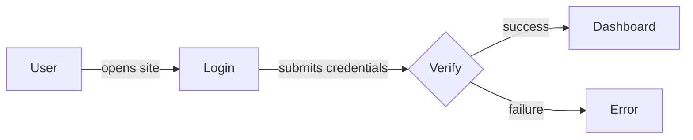

# User Flow Diagrams

The following diagram illustrates a typical authentication flow:

```mermaid
flowchart LR
    User -->|opens site| Login
    Login -->|submits credentials| Auth{Verify}
    Auth -->|success| Dashboard
    Auth -->|failure| Error
```

Additional flows can be documented here as the application evolves.
