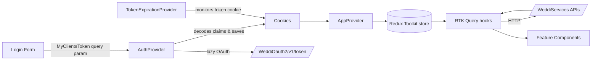
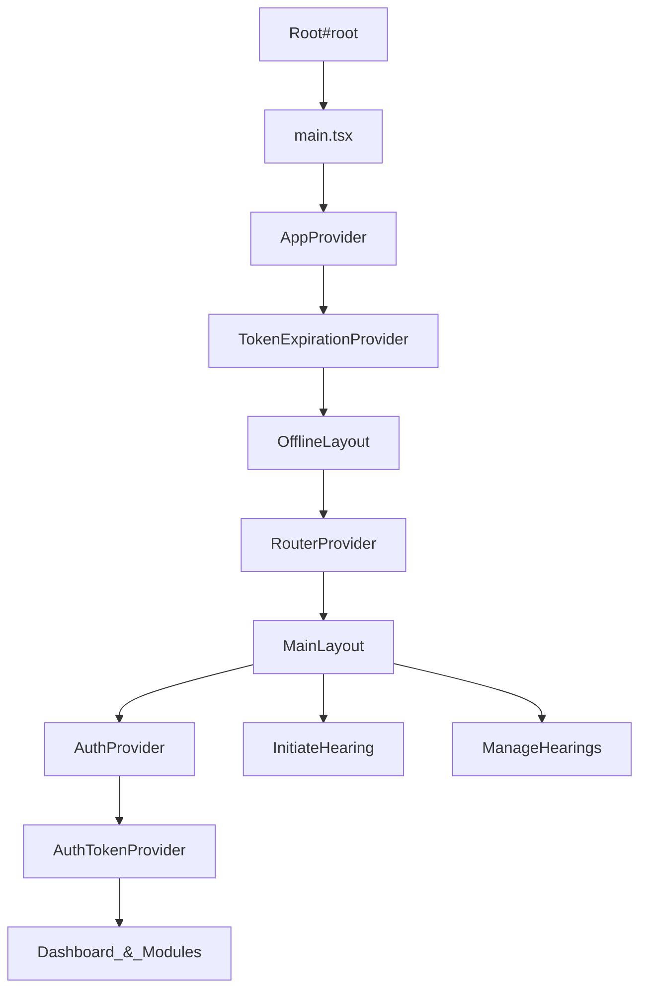
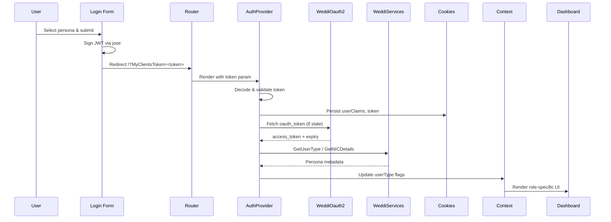

# Technical Design Document

Application: Weddi Portal Frontend

- Version: 1.0
- Date: 2025-09-21
- Repository: weddi-frontend (React + TypeScript)

## 1. Architecture Overview

The Weddi portal frontend is a single-page application delivered through Vite. React Router drives routing, Redux Toolkit powers predictable state, and RTK Query handles all server communication. Feature-driven directories keep domain logic isolated while shared providers inject cross-cutting concerns such as localization, tokens, tabs, and form orchestration.
| Layer | Description | Key technologies / assets |
| --- | --- | --- |
| Client UI | React SPA rendered inside the root element with Suspense fallbacks and layout composition. | src/index.tsx, src/app/App.tsx, src/shared/layouts/MainLayout.tsx |
| State & data orchestration | Redux store combines local slices with RTK Query's API cache; React Hook Form and cookie-backed contexts keep form and persona state synchronized. | src/app/store/index.ts, src/services/apiClient.ts, src/providers/FormContext.tsx, src/features/hearings/initiate/hooks/useCookieState.ts |
| Backend integrations | REST services for cases, schedules, lookups, and OAuth tokens served by WeddiServices and WeddiCreateCaseServices. | WeddiServices/V1/_, WeddiCreateCaseServices/V1/_, WeddiOauth2/v1/token |
| Cross-cutting concerns | Providers handle error boundaries, token refresh, date/calendar switching, tab coordination, and language direction. | src/providers/AppProvider.tsx, src/providers/TokenExpirationProvider.tsx, src/i18n/LanguageDirectionProvider.tsx, src/shared/components/tabs/TabsContext.tsx |

## 2. Major modules and responsibilities

| Module                           | Responsibilities                                                                                                             | Representative assets                                                                                                                                              |
| -------------------------------- | ---------------------------------------------------------------------------------------------------------------------------- | ------------------------------------------------------------------------------------------------------------------------------------------------------------------ |
| Login & session bootstrap        | Persona selection, JWT generation for impersonation, OAuth token acquisition, NIC lookups, cookie hydration.                 | src/features/auth/Index.tsx, src/features/auth/components/AuthProvider.tsx, src/providers/AuthTokenProvider.tsx                                                    |
| Dashboard                        | Authenticated landing page with banners, schedules, statistics, notifications, and case shortcuts.                           | src/features/dashboard/index.tsx, src/features/dashboard/components/HearingContent.tsx, src/features/dashboard/api/api.ts                                          |
| Initiate hearing (case creation) | Multi-step wizard for claimants/defendants, form persistence, topic management, OTP verification, acknowledgement downloads. | src/features/hearings/initiate/pages/InitiateHearingPage.tsx, src/features/hearings/initiate/modules/case-creation, src/features/hearings/initiate/api/create-case |
| Manage hearings                  | Tabular case lists, filters, role-based actions, case details, topic updates, attachment flows.                              | src/features/hearings/manage/components/ManageHearings.tsx, src/features/hearings/manage/api/myCasesApis.ts, src/features/hearings/manage/services                 |
| Shared infrastructure            | Global layouts, headers, tabs, modal/error handling, localization utilities, helpers, and reusable form inputs.              | src/shared/layouts/MainLayout.tsx, src/shared/components, src/utils                                                                                                |

## 3. State management and data flow

State is deliberately layered. Redux Toolkit stores global UI flags (loading counters, default form values, option selections). RTK Query extends the same store with data caches and exposes generated hooks. Context providers (UserProvider, UserTypeProvider, DateProvider, LanguageDirectionProvider, TabsProvider) bridge persona data, language, and calendar preferences across components. React Hook Form under FormProvider synchronizes wizard data, while useCookieState persists identity and case metadata for continuity across reloads.

- Redux store (src/app/store/index.ts) wires api.reducer with loading, form, formOptions, and DefaultValues slices for global flags.
- RTK Query base API (src/services/apiClient.ts) injects endpoints per feature and shares middleware to manage refresh, request transformation, and errors.
- AuthProvider, AuthTokenProvider, and TokenExpirationProvider coordinate JWT ingestion, OAuth refresh, and expiry notifications using cookies.
- FormProvider couples react-hook-form with stored defaults and exposes force validation/reset helpers to multi-step modules.
- useCookieState offers a typed wrapper over universal-cookie with event notifications so cookie mutations propagate between tabs and components.
  Data flow overview:

## 4. API integration patterns

config/api.ts defines a hardened base query. Requests are piped through transformRequest to stamp SourceSystem, AcceptedLanguage, and persona identifiers. customBaseQuery attaches both legacy MyClients tokens (accesstoken header) and OAuth bearer tokens, retries on 401/invalid_token by invoking refreshToken, and centralizes toast-driven error handling. Endpoints are composed via api.injectEndpoints so every feature registers its queries/mutations without circular dependencies.

- refreshToken exchanges client credentials against /WeddiOauth2/v1/token and caches oauth_token & expiry cookies for reuse.
- handleApiResponseLegacy plus handleApiErrors surface backend error codes while suppressing configured cases and redirecting on expiry.
- tokenQuery isolates OAuth flows (Content-Type form data) while customBaseQuery handles JSON APIs, enabling per-request header adjustments.
- keepUnusedDataFor tuning (e.g., dashboards keep cached data for 60s, lookups for 300s) balances freshness versus chatty endpoints.
- Mutations reuse the same Update endpoint (/WeddiCreateCaseServices/V1/Update) while injecting SourceSystem and persona fields via transformRequest to minimise payload duplication.
  | Context | Endpoint(s) | Purpose / notes |
  | --- | --- | --- |
  | Authentication & persona | /WeddiOauth2/v1/token, /WeddiServices/V1/GetUserType, /WeddiServices/V1/GetNICDetails | Obtain OAuth tokens, resolve user role metadata, fetch NIC profiles and embassy details. |
  | Dashboard | /WeddiServices/V1/GetCasesAudit, /WeddiServices/V1/GetCaseCount, /WeddiCreateCaseServices/V1/GetIncompleteCase, /WeddiServices/V1/WeddiCaseUINotifications | Render cards, counts, schedule timelines, and clear in-progress case data. |
  | Manage hearings | /WeddiServices/V1/MyCases, /WeddiServices/V1/GetCaseDetails, /WeddiServices/V1/MainLookUp | Paginated case grids, detail drawers, and status lookup values per role. |
  | Case creation | /WeddiCreateCaseServices/V1/Create\|Update\|FinalSubmit, /WeddiServices/V1/DownloadAttachment, /WeddiServices/V1/MOJContract | Persist claimant/defendant/work/topic payloads, download evidence, validate MOJ contract binding. |
  | Lookups & communication | /WeddiServices/V1/SubLookup, /WeddiServices/V1/MainLookUp, /WeddiCreateCaseServices/V1/GlobalOtp, /WeddiServices/V1/GetAttorneyDetails | Resolve regions, cities, occupations, OTPs, and legal representative mandates across wizard steps. |

## 5. Non-functional requirements

### 5.1 Performance & UX

- Vite dev/build pipeline ensures fast HMR locally and tree-shaken production assets.
- Route-level lazy imports with Suspense fallbacks (App.tsx) keep first paint lean and show Loader/StepperSkeleton placeholders.
- RTK Query caching (keepUnusedDataFor) reduces repeated network calls for dashboards, lookups, and attachments.
- Loader overlay and toast notifications (ToastContainer) provide non-blocking feedback while API calls run.
- FormProvider reset and event-based cookie syncing prevent stale wizard data when cases are cleared or cancelled.

### 5.2 Security & privacy

- AuthProvider validates JWT expiry before persisting claims and rotates OAuth tokens ahead of 5-minute thresholds.
- TokenExpirationProvider decodes the legacy token cookie, warns users within five minutes of expiry, and redirects using configured login URLs.
- handleApiError and handleApiErrors consolidate API failures, shield suppressed codes, and force logout on invalid_token events.
- Cookies default to path=/ with optional secure flag support in useCookieState; sensitive identifiers are read on demand rather than stored in localStorage.
- Attachments are fetched via signed keys passed through processAttachmentKey before calling DownloadAttachment.

### 5.3 Scalability & maintainability

- Feature-first directory structure isolates dashboard, manage-hearings, initiate-hearing, and login domains for independent evolution.
- api.injectEndpoints allows incremental endpoint registration without touching the central API definition.
- TypeScript interfaces (e.g., CaseRecord, NICDetailsResponse) document payload contracts and reduce runtime casting.
- Shared providers (UserProvider, TabsProvider, DateProvider) encapsulate behavioural contracts so UI components consume typed hooks rather than prop drilling.
- Configurable form builders (config/formConfig.tsx) centralise Hijri/Gregorian pairing and validation for reuse across wizard steps.

### 5.4 Localization & accessibility

- i18next dynamic resource loading (src/i18n/i18n.tsx) fetches namespace JSON on demand for Arabic and English.
- LanguageDirectionProvider flips document dir between rtl and ltr to keep layouts responsive for Arabic.
- Hijri and Gregorian date components expose mirrored inputs so users view dual calendars.
- Copy and alerts use react-i18next translations, and toasts are triggered with translated strings for consistency.
- OfflineLayout and navigation guards ensure core flows degrade gracefully when connectivity drops.

## 6. Deployment pipeline, environments, branching

Build automation should run deterministic scripts: install dependencies, lint/type-check (npm run check), build production assets (npm run build), and publish the dist directory to the hosting CDN or web server. CI pipelines can reuse Vite build outputs for smoke tests before promotion.

- Local: npm install → npm run dev (loads .env.local for VITE\_\* secrets).
- Quality gates: npm run check (tsc --noEmit + eslint) on every pull request.
- Build & package: npm run build emits static assets with hashed filenames under dist/.
- Deploy: Upload dist/ to the chosen static host (e.g., Nginx, CDN).
  | Environment | Purpose | Key settings |
  | --- | --- | --- |
  | Local development | Developer machines with hot reload and mocked persona tokens. | VITE_API_URL, VITE_API_SECRET(+ALG/ISSUSER/AUDIENCE/EXPIR_TIME), VITE_OAUTH_CLIENT_ID/SECRET/GRANT_TYPE |
  | QA / staging | Pre-production validation against staging WeddiServices endpoints. | Distinct VITE_API_URL and OAuth credentials; enable VITE_LOGIN_SWITCH if local IdP is required. |
  | Production | Public portal with optimized bundle and runtime monitoring. | Secrets stored in deployment environment variables; redirect URLs set via VITE_REDIRECT_URL(\_LOCAL). |
  Branching guidelines:
- main holds production-ready code; protect with reviews and status checks.
- Create feature/\* branches per deliverable and raise PRs into main (or develop if adopted).
- Tag releases after successful deployment; hotfix branches may cherry-pick critical fixes back into main.

## 7. Reference diagrams

### 7.1 Component hierarchy

Mermaid definition:

### 7.2 Login and data bootstrap sequence

Mermaid definition:

